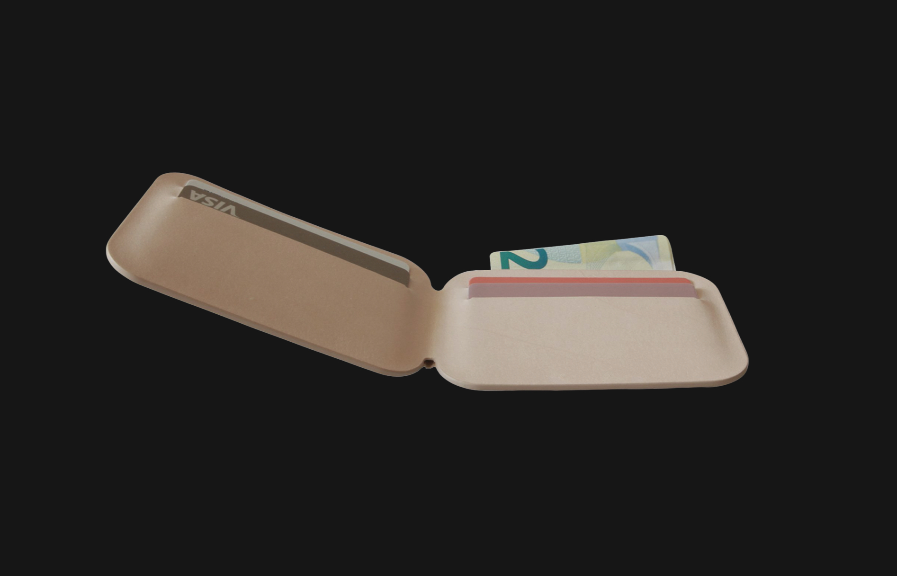
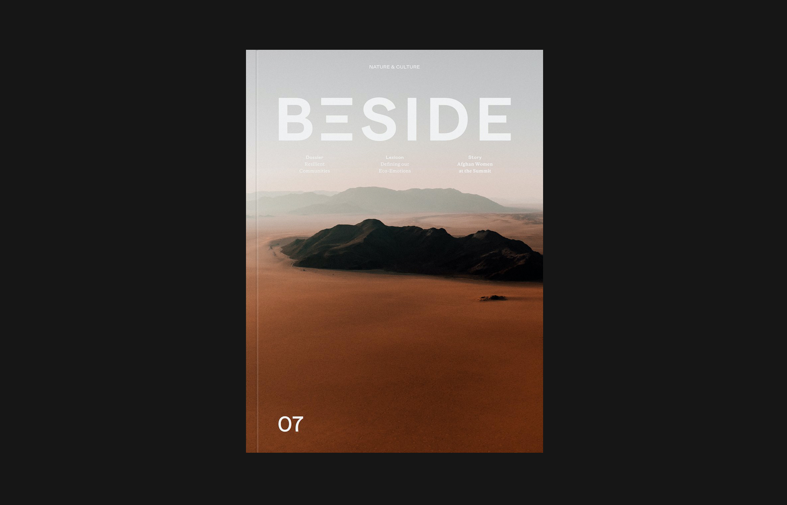
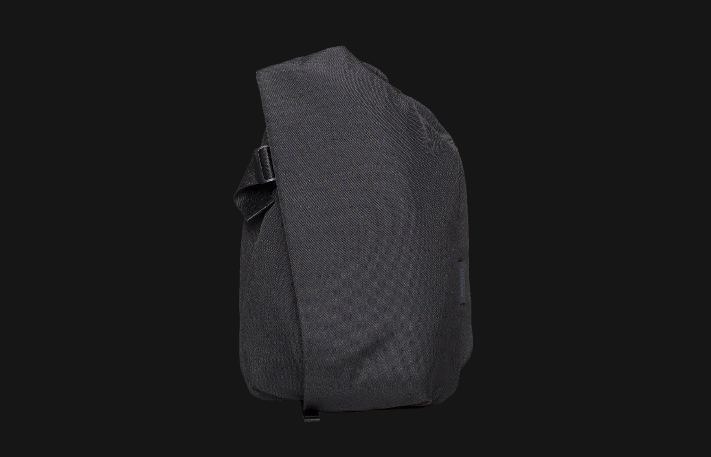
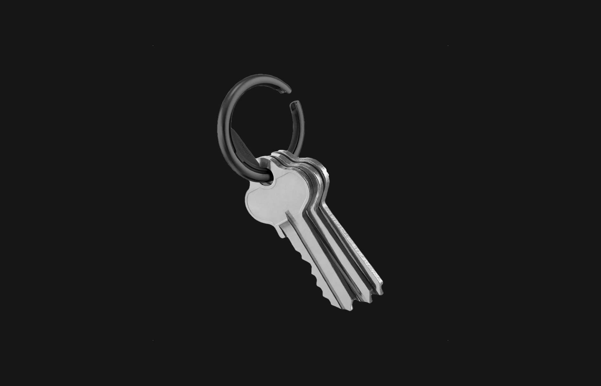
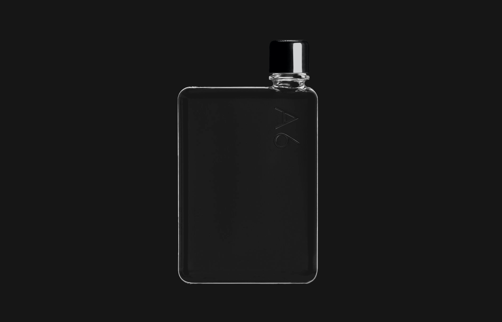
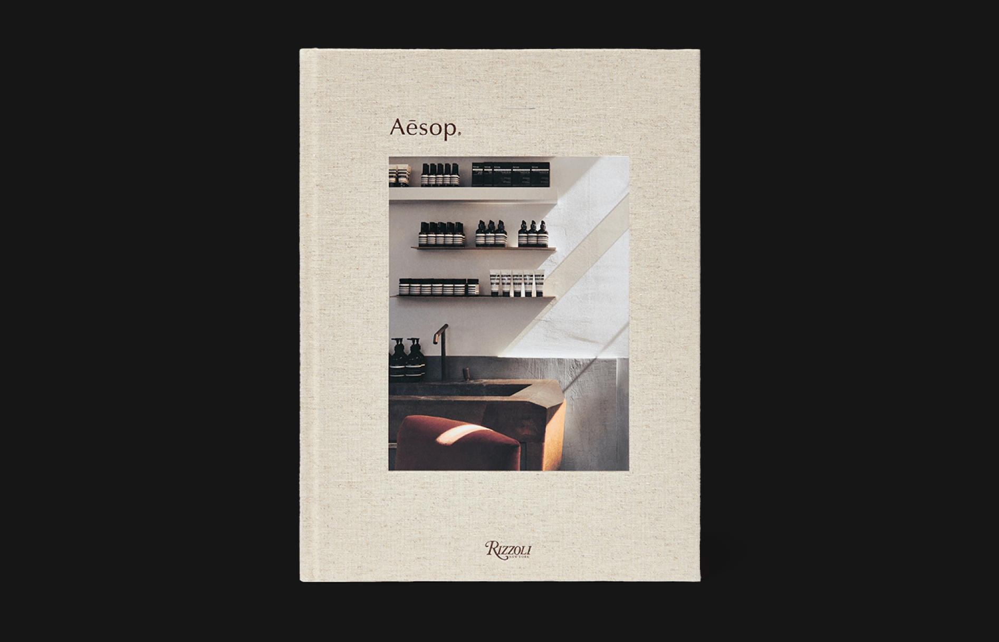

import Button from "../../components/Button"
import NewFigure from '../../components/NewFigure'

import Image from '../../components/Image'

I'm a notoriously difficult person to buy gifts for. With this holiday season coming up, I thought I'd take a stab at curating a list of gift ideas that you can buy for the Kevin in your life.

### [Resurrection Aromatique Hand Wash](https://www.aesop.com/ca/en/p/body-hand/hand/resurrection-aromatique-hand-wash/)

<Image src="./aesop-hand-soap.jpg" caption="Image Copyright Aesop" />

The best gifts are experiences. The second best gifts are small luxuries that you wouldn't necessarily buy for yourself. An Aesop bottle elevates any space that it's in and the Mandarin Rind in this hand soap will make bring joy to something we do mechanically all the time. If you're not sure where to start with Aesop, this is the gateway drug.

<Button primary={true} href="https://www.aesop.com/ca/en/p/body-hand/hand/resurrection-aromatique-hand-wash/">Buy at Aesop&ensp;&middot;&ensp;$51</Button>

### [Wallet Type 1](https://store.leibal.com/products/wallet-type1)

I first discovered this wallet on Andrew Kim's Instagram. But what sold me on it was the craftsmanship involved into making a wallet like this with no visible stiches. I've been using it for a few days and I'm absolutely in love with how it looks and functions as a practical object.

<Button primary={true} href="https://store.leibal.com/products/wallet-type1">Buy at Leibal&ensp;&middot;&ensp;$149</Button>

### [Beside Magazine](https://shop.beside.media/products/issue-07)

Made in Montréal, this magazine brings together philosophers, artists, entrepreneurs, farmers, scientists and adventurers around one compelling question: what risks are we willing to bear? On top of being a fantastic read, this magazine is guaranteed to look fantastic on your coffee table.

&rarr; [Buy from Beside](https://shop.beside.media/products/issue-07)&ensp;&middot;&ensp;$20

### [Côte & Ciel Isar Rucksack](https://www.coteetciel.com/collections/all-black/products/isar-m-ecoyarn-black)

I've been using this backpack every day for the past 3 years and I still love it as much as I did when I bought it. In fact, I might love it more. The design philosophy of this company is that they want the contents of your bag to influence the outside appearance of the bag. Therefore, depending what you put in it, its shape will adapt to fit the contents.

&rarr; [Buy at Côte & Ciel](https://www.coteetciel.com/collections/all-black/products/isar-m-ecoyarn-black)&ensp;&middot;&ensp;$295

### [Orbitkey Ring](https://www.orbitkey.com/collections/orbitkey-ring/products/orbitkey-ring?variant=12219371454560)

I don't know how often you think of your key ring. The only time I really think about my keyring is when I have to take keys in and out of it. How terrible is that design? For most of my life I just pushed through it and just accepted it as a fact of life. That's until I discovered the Orbitkey Ring, which uses a clever mechanism to make getting keys in and out of it super easy.

&rarr; [Buy from Orbitkey](https://www.coteetciel.com/collections/all-black/products/isar-m-ecoyarn-black)&ensp;&middot;&ensp;$14.90

### [Memobottle A6](https://www.memobottle.us/collections/shop-all/products/a6-memobottle-1)

Memo bottles are water bottles that are rectangular instead of being circular. That makes them much easier to carry with you in a jacket pocket wherever you go. It's simple as that.

&rarr; [Buy from Orbitkey](https://www.coteetciel.com/collections/all-black/products/isar-m-ecoyarn-black)&ensp;&middot;&ensp;$38

### [Aesop: The Book](https://www.aesop.com/ca/en/p/home/home-gifts/aesop-the-book/)

For the fan of Aesop in your life, this book documents the company ethos, how their packaging has evolved throughout the years and breaks down the artistic collaborations that produced some of their most iconic retail locations.

&rarr; [Buy at Aesop](https://www.aesop.com/ca/en/p/body-hand/hand/resurrection-aromatique-hand-wash/)&ensp;&middot;&ensp;$100
