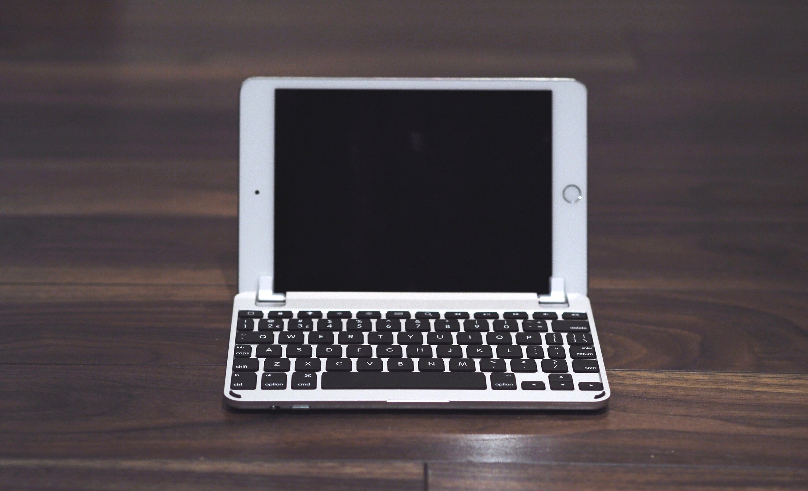
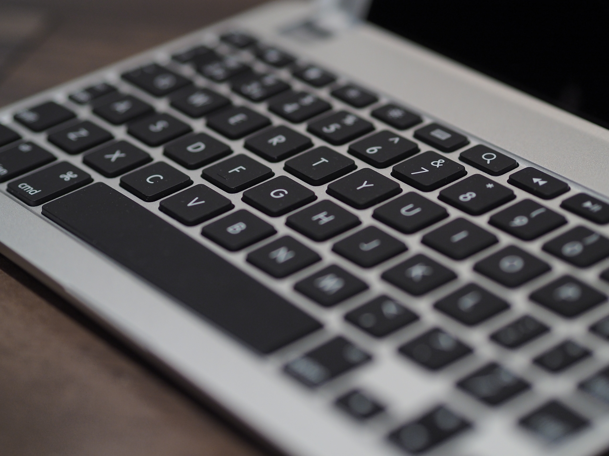

Since getting my iPad Mini 4, I've been completely in love with it. I use it for reading, browsing Twitter, watching movies and TV shows, writing, keeping up with Slack, amongst many other things. Split-Screen and Picture-in-Picture really made the iPad a great productivity device for me. There was only one piece of the puzzle missing for me: a good bluetooth keyboard. So I did a bit of research and got what seemed like the best bluetooth keyboard available: the [Brydge Mini II bluetooth keyboard][Brydge].

### Build quality
The build quality is really nice. The finish looks great and it’s super sturdy. It feels as close to a Macbook Pro keyboard as possible without being one. You can tell that the makers of this keyboard love Apple products.

### Keys

The keys have a good amount of travel for a keyboard that size. Again, it’s very similar to the MacBook Pro in that regards. I think it could have gotten away with slightly less travel (like the new Magic Keyboard) to make the keyboard a bit thinner without sacrificing on the typing experience too much.

A nice surprise was the fact that the keys are backlit. I don’t think it’s necessarily required in a mobile keyboard, but it’s definitely a nice touch.

The feel of the keys on the other hand is probably a place that could use some improvement. Some of the keys around the edges of the keyboard produce a squeaky sound when pressing them. It feels like they’re not entirely stable in their enclosure, which makes the typing experience less pleasant. It’s definitely not a deal breaker, but because the rest of the keyboard feels so premium, I was expecting the keys to be perfect.

The row of function buttons at the top of the keyboard is super useful. I found myself using the play/pause, volume up / down and search buttons a lot in daily use. It makes you wonder why Apple doesn’t include those on the first party Smart Keyboard on the iPad Pro.

Brydge has done a terrific job at scaling down a full-size keyboard into the width of an iPad Mini. The keys are smaller than a full-size keyboard (there's no way around that), but I found that the adjustment time was minimal. I think that has a lot to do with the much smaller than normal keys they used for punctuation characters you don't use often. For example, the `;`, `'` and `[` keys are half the size of the other keys on the keyboard. That allows the rest of the keys to still be at a decent size for typing. There is, however, one thing about the keyboard layout that is pretty frustrating in daily use: the `tab` button. In order to save space, they put tab and caps lock on the same key. That means that you have to hit `Ctrl + Caps lock` in order to produce a tab. Why does that matter? Because tab is a very frequently used key. On my Mac I `cmd + tab` all the time, but with this keyboard it's inconvenient enough that I still find myself double pressing the home button instead. On top of that, if you're coding on the iPad (something I'm doing more and more) the `tab` key is very important. In comparison, `caps lock` is something I use very rarely. I feel like they got that key backwards. In my opinion, `tab` should be the main action and `caps lock` should be the secondary action. Another idea would be to put the `caps lock` function on the shift key. From a mental model perspective, this would make more sense since `shift` makes a single letter uppercase and `control + shift` would turn caps lock on. Other than that, I think they did a great job with the layout of this keyboard and I can imagine what a challenge that was.

### The iPad holder

One of the defining features of this keyboard are the two little arms that hold your iPad and allow you to adjust the angle the way you want. That’s a nice idea in theory, but in my usage I found myself always using the iPad at the same angle, which was made more difficult by the fact that these little arms can move freely. You also need to be careful about adjusting the screen simply by pushing your iPad. I noticed that if the arms weren’t perfectly aligned with the sides of the iPad, it would press down on the screen and ripple the image, which didn’t seem like a good thing to do to your iPad. On top of that, the arms hold the iPad a bit too low compared to the keyboard, making it really hard to touch the bottom parts of the screen. I believe they had to do this in order to have the iPad sit flush with the case once closed, but I don’t think the tradeoff is worth it. A nice touch is that when you fold the iPad over the keyboard, the screen turn off automatically like it does with a Smart Cover. I’m not sure why, but I didn’t expect that when I first closed it and was pleasantly surprised.

### On/Off switch
The on/off switch has a good placement, right in front of the device and feels good to toggle. I wish it had a clearer way to see if the keyboard is on or off at a glance. I wish they had taken cues on the on/off toggle of the Magic Keyboard and Magic Mouse where one side is green and one side is grey to indicate if the device is on or not.

### Battery life
I’ve had it for a couple of weeks and I still haven’t had the need to charge it up, so I’d say it’s pretty good on that front. I wish it showed the battery status in the status bar and in Notification Center like some Bluetooth headphones do, this way I’d be able to know wether or not I should charge my keyboard before going to work in the morning. That being said, since the battery lasts so long, that's not a big issue.

### Conclusion
Overall, this is a well-built, high quality keyboard that makes the most out of the incredibly small size that the iPad Mini requires. There’s still room for improvement though. It’s as thick as the iPad itself and a good bit heavier, I’d love it if it used Lightning instead of Micro USB and I wish it had better integration with the system.

Nevertheless, I find myself using my iPad a lot more because of this keyboard. I use it to write emails and blog posts, tweak my website, work on slides for a talk. Having a keyboard really completes the iPad and makes it even more of a productivity device than it was before. I’m excited to see more keyboard optimizations coming to iOS in the future. In the meantime, I'm using this keyboard every day and I love the fact that it turns my iPad into a mini typewriter.

[You can buy the Brydge Mini II on Brydge’s website](http://www.brydgekeyboards.com/products/brydgemini-ii?variant=8305506753)

[Brydge]: http://www.brydgekeyboards.com/products/brydgemini-ii?variant=8305506753
