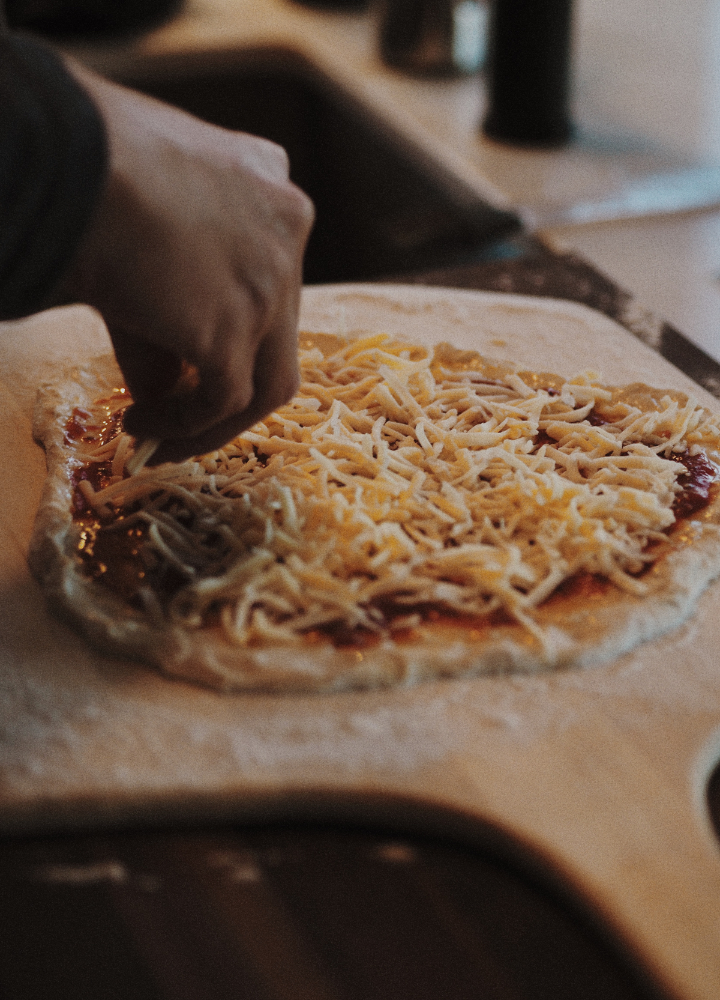

I'd like to preface this article by saying I'm by no means an expert on making your own pizza. I just recently started dabbling in making my own dough and these were the tips that helped me the most. I'm both writing this for some friends who asked for my tips, and for past me (to make sure I don't forget).

### Making the Dough
### Can be done up to 2 days ahead

**Note:** My recipe is an adapted recipe from [Bon Appetit](https://www.bonappetit.com/recipe/pizza-dough-2).

#### Secrets:
* The best pizza dough is in the 70-80% hydration range. Hydration just means the water to flour ratio. [Learn more](https://pizzaotherbread.wordpress.com/2016/02/28/pizza-dough-hydration-trial/)
* While you prepare the dough, your hands and even the countertop can suck the moisture out of your dough. Make sure you spray the countertops and your hands frequently. [Learn more](https://www.youtube.com/watch?v=xREpnr1Frf8)

#### Ingredients:
* **177g** warm water (105°F to 115°F)
* **240g** flour (ideally [Typo 00 Flour](https://www.amazon.ca/gp/product/B0038ZS6PU))
* **8g** active dry yeast
* **1 teaspoon** sugar
* **¾ teaspoon** salt

#### Steps:
1. Pour **177g warm water** into small bowl; stir in **8g of yeast**. Let stand until yeast dissolves, about **5 minutes**.
2. In a separate bowl, mix **240g flour**, **1 teaspoon sugar**, and **1 teaspoon salt**.
3. Add yeast mixture and mix until the dough forms in a sticky ball (use your hands to form it).
4. Knead dough. [Follow what they do in this video](https://www.youtube.com/watch?v=xREpnr1Frf8)
5. Let the dough rise in an airtight container for **30 mins**.
6. Separate the dough in 2 balls.
7. Done! (If you’re doing this ahead of time, put your dough balls in the fridge in airtight containers.)

---

### Preparing the pizza
⚠️ Make sure you preheat your oven first (see below)

#### Secrets:
* Never use a rolling pin. It will destroy the bubbles that we want in the crust. The best technique is to use gravity to help you by lifting the dough.
* The dough smells fear. So when you transfer your pizza from the peel to the stone, don’t hesitate just go for it.

#### Steps:
0. Take your dough ball out at least an hour before you prepare your pizza to give it time to warm up to room temperature.
1. Dunk your dough balls in a bowl of flour (so that the bottom of your ball has flour on it).
2. Expand the dough by lifting and turning it in the air.

---

### Baking the pizza
#### Secrets:
* You want your oven to be as hot as possible. Unfortunately, regular home ovens don’t get that hot, so we’ll use the bake/broil technique to get as close as possible. [Lean more about this technique](https://pizzaotherbread.wordpress.com/2015/02/20/how-to-bake-pizza/).

#### Materials:
* [Pizza Stone](https://thewirecutter.com/reviews/best-pizza-stone-and-baking-steel/)
* Pizza Peel

#### Steps:
1. Set the grill to the highest position.
2. Put your stone in the oven.
3. Preheat your over to the **maximum temperature** it will go for at least **1 hour** before you bake.
4. **5 minutes before** you bake your pizza, set the oven to **broil**.
5. Right before you put your pizza in the oven, set it back to **bake**.
6. Bake for **4 minutes**.
7. Switch your oven to **broil** again for **2-3 minutes**.
8. Done!
